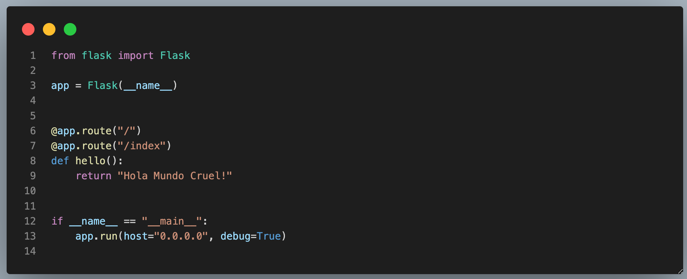
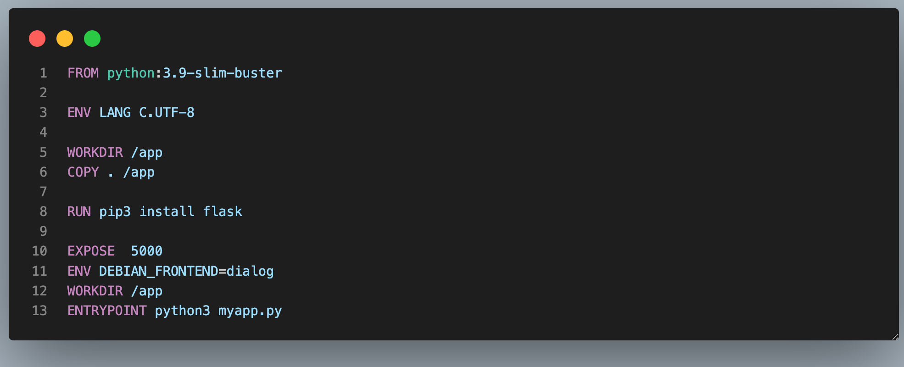
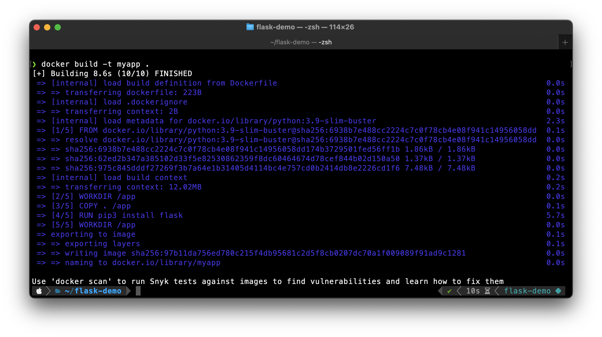
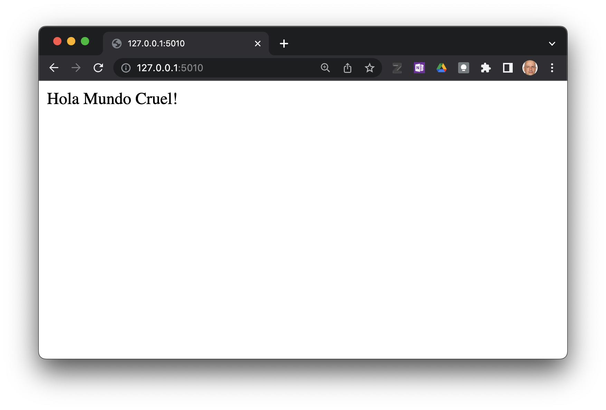
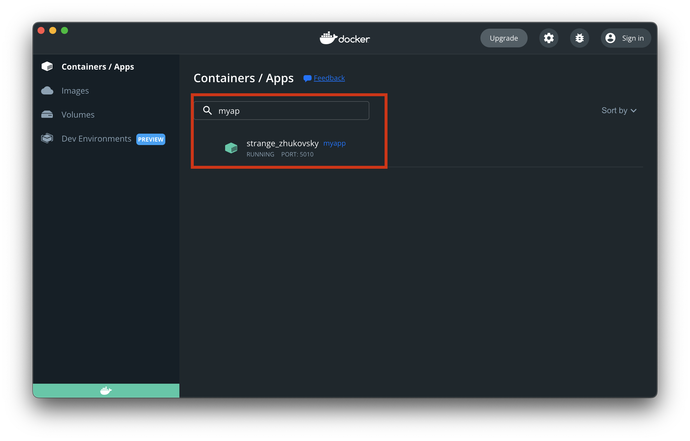

Introducción a Docker
=========================================================================================

1.--- Cree un carpeta de trabajo, y en ella, cree el archivo `myapp.py`.

2.--- Cree el archivo `Dockerfile` en la carpeta de trabajo.

3.--- Cree la imágen de Docker con: 

.. code:: bash

    $ docker build -t myapp .

4.---  Ejecute la app con:

.. code:: bash

    $ docker run -dp 5010:5000 myapp

5.--- Verifique que la app esté funcionando en el navegador. Vaya a la dirección http://127.0.0.1/5010/

6.--- Docker dashboard

