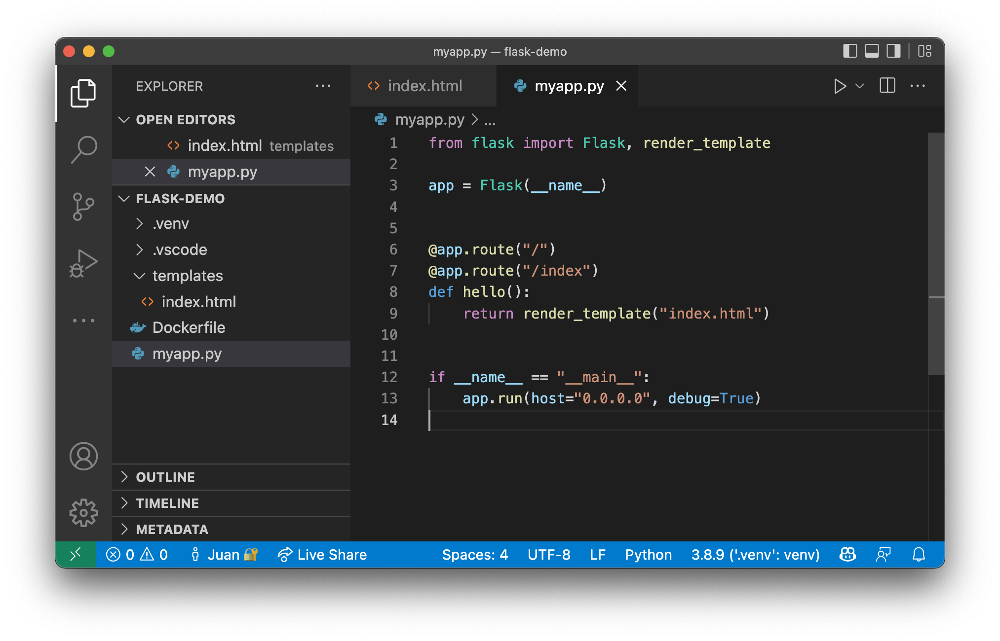
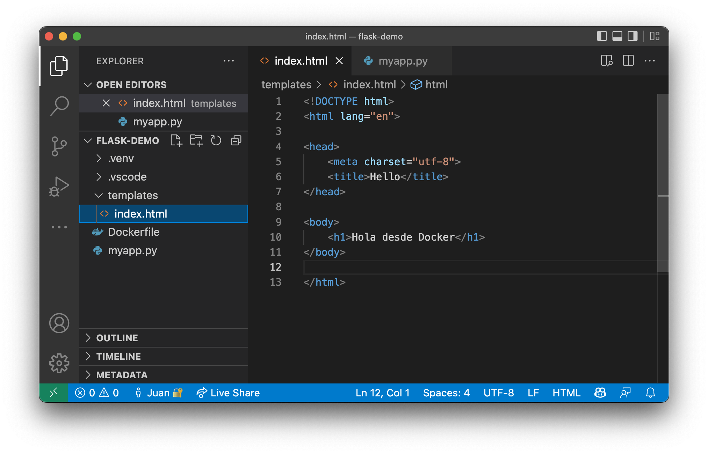
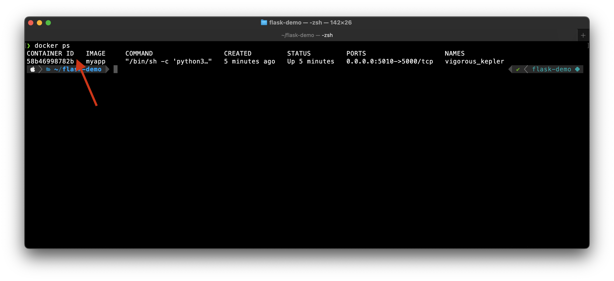
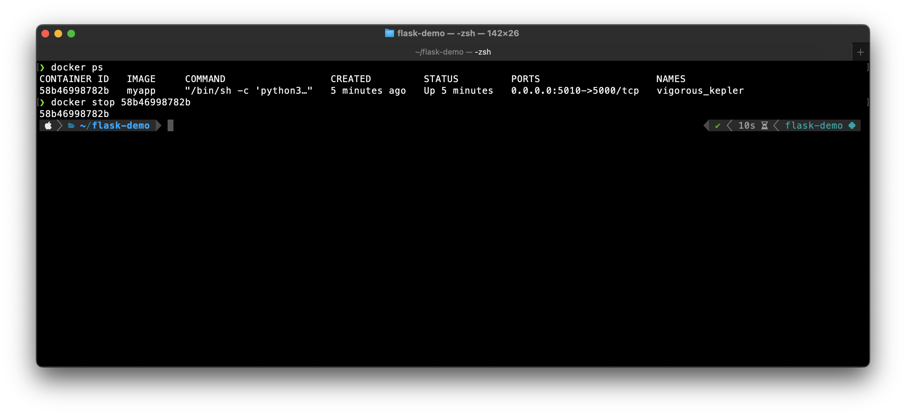
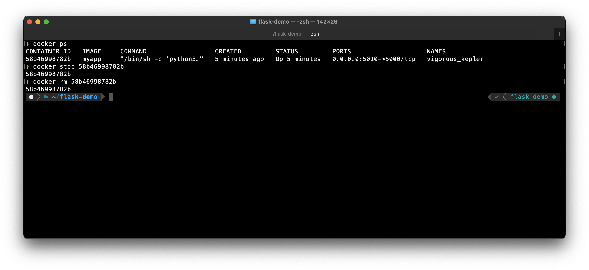
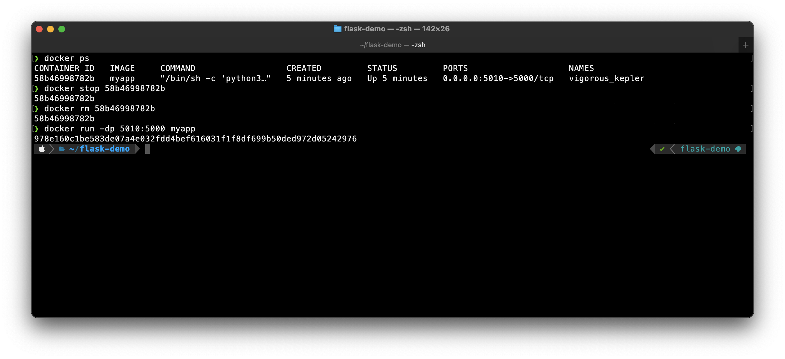
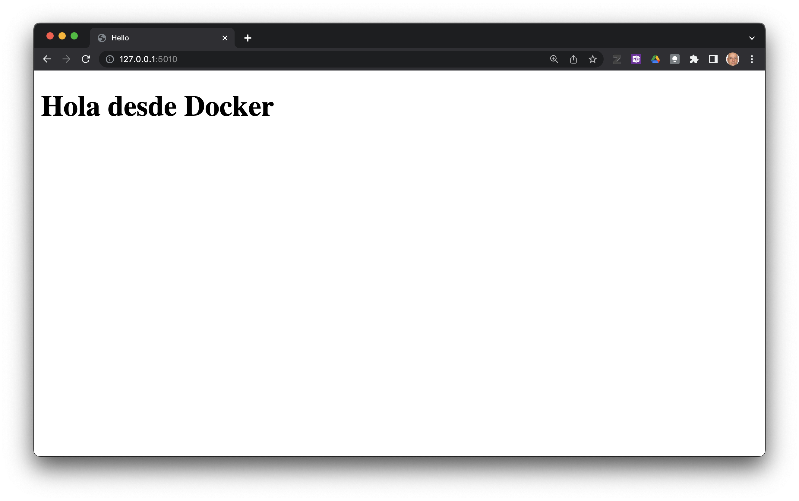

Actualización de la aplicación
=========================================================================================

**Modificación del código fuente**

1.--- Modifique el código del archivo `myapp.py`

2.--- Agregue el archivo `templates/index.html` 

3.--- Actualice la imagen de docker con:

.. code:: bash

    $ docker build -t myapp .

4.--- Reemplace el contendor antiguo por el nuevo. Obtenga el ID del contendor con: 

.. code:: bash

    $ docker ps

5.--- Detenga el contendor antiguo con:

.. code:: bash

    $ docker stop <id>

6.-- Borre el contendor antiguo con:

.. code:: bash

    $ docker rm <id>

7.--- Inicie el nuevo contendor con:

.. code:: bash

    $ docker run -dp 5010:5000 myapp

